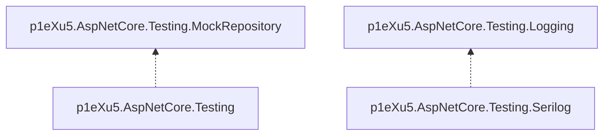

p1eXu5.AspNetCore.Testing
=========================



## p1eXu5.AspNetCore.Testing.Logging

### Create ILogger

```fsharp
let private logger = TestLogger<Foo>(TestContextWriters.GetInstance<TestContext>(), LogOut.All) :> ILogger<DrugsApiClient>
```

### Create ILoggerFactory

```fsharp
let private loggerFactory = TestLoggerFactory(TestContextWriters.GetInstance<TestContext>())
```

## p1eXu5.AspNetCore.Testing.Logging

```cs
// WebApplicationFactory<_>
protected override void ConfigureWebHost(IWebHostBuilder builder)
{
    builder.ConfigureServices(services =>
    {
        services.AddSerilog(
            (services, lc) => lc.MinimumLevel.Debug(),
            writeToProviders: true // to use Microsoft logger providers
        );

        services.AddLogging(cfg =>
        {
            cfg.ClearProviders();
            // cfg.SetMinimumLevel(LogLevel.Warning); // is not accounting
            cfg.AddTestLogger(TestContextWriters.GetInstance<TestContext>(), LogOut.All);
        });
    });
}
```

## p1eXu5.AspNetCore.Testing.Seriloig

```cs
// WebApplicationFactory<_>
protected override void ConfigureWebHost(IWebHostBuilder builder)
{
    builder.ConfigureServices(services =>
    {
        builder.UseSetting("Serilog:Using:2", "p1eXu5.AspNetCore.Testing.Serilog");
        builder.UseSetting("Serilog:WriteTo:2:Name", "NUnit");
        builder.UseSetting("Serilog:WriteTo:2:Args:logOut", "2"); // 1 - Progress, 2 - Out, 3 - LogOut.All (default)

        builder.ConfigureAppConfiguration((ctx, b) =>
        {
            ctx.Configuration["Serilog:WriteTo:0"] = ""; // disable Console (if set)
            ctx.Configuration["Serilog:WriteTo:1"] = ""; // disable Debug (if set)
            ctx.Configuration["Serilog:WriteTo:2"] = null; // reset to null, cause is set as ""
        });
    });
}
```

## p1eXu5.AspNetCore.Testing

### MockRepository

```fsharp
// Fixture module

open Microsoft.Extensions.Logging
open NUnit.Framework
open p1eXu5.AspNetCore.Testing.Logging
open p1eXu5.AspNetCore.Testing
open p1eXu5.AspNetCore.Testing.MockRepository

type internal FooWebApi =
    {
        Client: FooApiClient
        MockRepository: MockRepository
    }

let mutable private client = Unchecked.defaultof<_>

let mutable private _mockRepository = Unchecked.defaultof<_>

let mutable internal _instance = Unchecked.defaultof<_>

[<OneTimeSetUp>]
let init () =
    let factory =
        (new FooWebApplicationFactory())
            .WithWebHostBuilder(fun builder ->
                builder.AddMockRepository(
                    [Service<IFooRepository>()],
                    lorWriter,
                    (fun mr -> _mockRepository <- mr)
                )
            )

    let fooApiClientLogger = TestLogger<DrugsApiClient>(TestContextWriters.GetInstance<TestContext>(), LogOut.All) :> ILogger<DrugsApiClient>

    _instance <-
        {
            Client = FooApiClient.init client fooApiClientLogger
            MockRepository = _mockRepository
        }

[<OneTimeTearDown>]
    let dispose () =
        match box client with
        | null -> ()
        | _ ->
            client.Dispose()

// Test module

open System.Threading
open System.Linq

open NUnit.Framework
open FsUnit.TopLevelOperators
open NSubstitute
open p1eXu5.AspNetCore.Testing
open p1eXu5.AspNetCore.Testing.Logging
open p1eXu5.FSharp.Testing.ShouldExtensions

[<SetUp>]
    let setWriters () =
        TestContextWriters.Default.SetWriters(TestContext.Progress, TestContext.Out)

[<Test>]
let ``search endpoint, when foo repo is empty, returns ok`` () =
    task {
        let fooRepoMock = FooWebApi._instance.MockRepository.TrySubstitute<IFooRepository>()
        let _ =
            fooRepoMock
                .SearchFooAsync(Unchecked.defaultof<_>, Unchecked.defaultof<_>)
                .ReturnsForAnyArgs(Enumerable.Empty<FooCard>())

        let! response = FooWebApi._instance.Client.SearchAsync "foo" CancellationToken.None

        response |> should be (ofCase <@ ApiRequestResult<FooCard list>.Ok @>)
        let! _ = fooRepoMock.ReceivedWithAnyArgs(1).SearchFooAsync(Unchecked.defaultof<_>, Unchecked.defaultof<_>)

        return ()
    }
```
